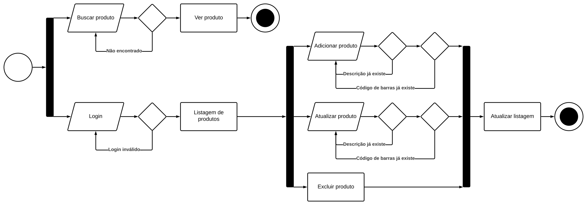

# UTD - Linguagem de Programação PHP | Exercício de Progressão de Módulo 3

## Universidade do Trabalho Digital (UTD)

A Universidade do Trabalho Digital – UTD é uma iniciativa do Governo do Estado 
do Ceará, através da Secretaria da Ciência, Tecnologia e Educação Superior 
(Secitece) que desenvolve as suas atividades em parceria com o Instituto 
Centro de Ensino Tecnológico (CENTEC). Com cursos que vão desde uma formação 
básica até níveis mais avançados, a UTD proporciona formação gratuita na área 
de Tecnologia da Informação e Comunicação (TIC).

## Curso Online Linguagem de Programação PHP

O Curso Online Linguagem de Programação PHP ofertado pela Universidade do 
Trabalho Digital possui carga horária de 120 horas e duração de 3 meses. Ele 
aborda os principais conceitos e funcionalidades do PHP, uma linguagem de 
programação utilizada por programadores e desenvolvedores para construir sites 
dinâmicos, extensões de integração de aplicações e agilizar no desenvolvimento 
de um sistema.

O Módulo III - Banco de Dados aborda:
- Unidade I – Fundamentos do MySQL e SQL Relacional
- Unidade II – Consultas SQL Avançadas no MySQL
- Unidade III – Modelagem Avançada no MySQL
- Unidade IV – Segurança e Gerenciamento de Usuários no MySQL
- Unidade V – Desenvolvimento de Aplicações Web com PHP e MySQL
- Unidade VI – Projeto Prático - Aplicação CRUD com MySQL e PHP

## Aplicação

### Estrutura de Pastas

```
├── assets
├── components
│   ├── searchbar.php
│   ├── sidebar.php
│   ├── table.php
│   └── topbar.php
├── css
│   ├── pagination.css
│   └── styles.css
├── js
│   ├── pagination.js
│   └── script.js
├── modules
│   └── products
│       └── products.php
├── pages
│   ├── admin.php
│   └── home.php
├── connection.php
├── content.php
├── index.php
├── login.php
└── logout.php
```

### Diagrama de Atividades


### Construção de Tabelas

```sql
CREATE TABLE `users`( 
  `id` INT PRIMARY KEY AUTO_INCREMENT,
	`username` VARCHAR(20) UNIQUE KEY NOT NULL,
	`password` VARCHAR(20) NOT NULL
);

CREATE TABLE `products`(
	`id` INT PRIMARY KEY AUTO_INCREMENT,
	`description` VARCHAR(80) UNIQUE KEY NOT NULL,
	`ean_code` VARCHAR(13) UNIQUE KEY NOT NULL,
	`retail_price` FLOAT(7,2) DEFAULT 0.1,
	`wholesale_price` FLOAT(7,2) DEFAULT 0.1,
	`details` TEXT(500),
	`section` VARCHAR(80) NOT NULL
);
```

### Ferramentas e Tecnologias Utilizadas


